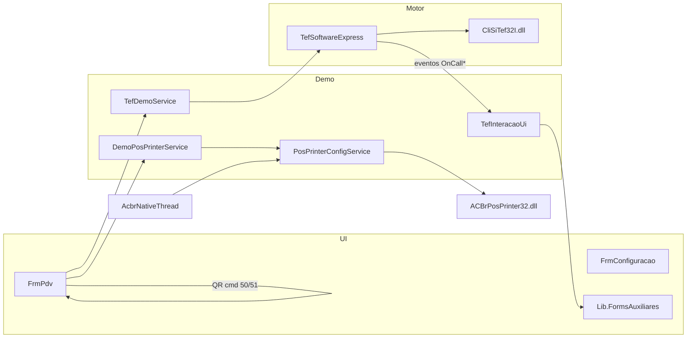

# ACBr CliSiTef Demo

[](https://dotnet.microsoft.com/download/dotnet-framework/net48)
[-important)]()
[](https://github.com/antoniocarlosjr97/acbr-clisitef-demo)

Demonstração **PDV WinForms** para integração e homologação da biblioteca **CliSiTef** (Fiserv / Software Express), mantida pelo **Projeto ACBr**.

Evolui o demo de referência da Software Express (`App.CliSiTef_DLL` / `FrmTelaTesteVenda`), com interface de caixa unificada, impressão de comprovantes via **ACBrLib.PosPrinter** (NuGet) e fluxo de QR Code Pix na tela do PDV.

> **Atenção:** este repositório é uma **aplicação de demonstração**. Não substitui um PDV fiscal completo nem dispensa a homologação oficial junto à Software Express/Fiserv.

### Para quem é

- Desenvolvedores que integram **ERP, PDV ou automação comercial** com CliSiTef.
- Equipes em **homologação** com SiTef Demo e kit simulado.
- **Não é** produto homologado para produção; adapte o código às regras do seu contrato Fiserv/Software Express.

---

## Início rápido

Checklist para rodar o demo pela primeira vez:

1. **Clone** o repositório e entre na pasta da solution.
2. **Restaure** os pacotes NuGet e **compile** a solution.
3. Copie as **DLLs do CliSiTef simulado** para `ACBr.CliSiTef.Demo\bin\Debug\` (mesma pasta do `.exe`).
4. Copie **`ACBrPosPrinter32.dll`** para `ACBr.CliSiTef.Demo\bin\Debug\ACBrLib\x86\`.
5. Instale e inicie o **SiTef Demo** (homologação).
6. Execute `ACBr.CliSiTef.Demo.exe` e aguarde **TEF inicializado com sucesso** no log.

```powershell
git clone https://github.com/antoniocarlosjr97/acbr-clisitef-demo.git
cd acbr-clisitef-demo
msbuild ACBr.CliSiTef.sln /t:Restore
msbuild ACBr.CliSiTef.sln /p:Configuration=Debug
# Copie DLLs TEF e ACBrLib (ver seção "Artefatos externos")
.\ACBr.CliSiTef.Demo\bin\Debug\ACBr.CliSiTef.Demo.exe
```

---

## Índice

1. [Visão geral](#visão-geral)
2. [Requisitos](#requisitos)
3. [Artefatos externos obrigatórios](#artefatos-externos-obrigatórios)
4. [Estrutura do repositório](#estrutura-do-repositório)
5. [Instalação, build e execução](#instalação-build-e-execução)
6. [Distribuição / deploy](#distribuição--deploy)
7. [Utilizando o demo](#utilizando-o-demo)
8. [Configurações](#configurações)
9. [Arquitetura do código](#arquitetura-do-código)
10. [Impressão de comprovantes](#impressão-de-comprovantes)
11. [QR Code (Pix / carteira digital)](#qr-code-pix--carteira-digital)
12. [Arquivos gerados em runtime](#arquivos-gerados-em-runtime)
13. [Homologação TEF (SiTef Demo)](#homologação-tef-sitef-demo)
14. [Solução de problemas](#solução-de-problemas)
15. [Referências](#referências)
16. [Licenciamento e responsabilidade](#licenciamento-e-responsabilidade)

---

## Visão geral

| Item | Detalhe |
|------|---------|
| **Plataforma** | Windows, .NET Framework **4.8** |
| **Arquitetura do processo** | **x86 (32 bits)** — obrigatório para CliSiTef e ACBrLib |
| **UI** | WinForms (`FrmPdv` + `FrmConfiguracao`) |
| **TEF** | `Lib.CliSitef` → P/Invoke em `CliSiTef32I.dll` |
| **Impressão** | NuGet `ACBrLib.Core` + `ACBrLib.PosPrinter` + DLL nativa `ACBrPosPrinter32.dll` |
| **Formulários TEF** | `Lib.FormsAuxiliares` (menu, coleta, aguarde, confirmações) |

### Funcionalidades do PDV

- Aba **Venda**: documento, valor da operação, pagamentos parciais (débito, crédito, carteira digital).
- Grid de pagamentos com status até **Nova venda**.
- **Comprovante (preview)** e **Log de execução** em tempo real.
- **QR Code** centralizado sobre o grid (comandos SiTef 50/51, campo 584).
- Aba **Administrativo** (menu SiTef).
- **Configuração** de TEF, pinpad e impressora ESC/POS.

---

## Requisitos

### Software

- **Windows** 10 ou superior (SO 64 bits; o **processo** do demo é 32 bits).
- **.NET Framework 4.8** ([download Microsoft](https://dotnet.microsoft.com/download/dotnet-framework/net48)).
- **Visual Studio 2022** ou **Build Tools** com carga de trabalho **Desenvolvimento para desktop com .NET**.
- **Gerenciador TEF SiTef** instalado e configurado (ambiente de homologação/simulado).

### Contrato e credenciais

- Acesso ao **portal do cliente** Software Express/Fiserv para downloads simulados e documentação (links na seção [Referências](#referências)).
- Empresa, terminal e CNPJs válidos para o ambiente em que o SiTef Demo está configurado.

---

## Artefatos externos obrigatórios

O repositório **não versiona** DLLs nativas de TEF nem da ACBrLib (ver `.gitignore`). O build **não** as copia automaticamente.

| Origem | O que obter | Destino (após build) |
|--------|-------------|----------------------|
| Kit **CliSiTef simulado** | `CliSiTef32I.dll` e dependências | `ACBr.CliSiTef.Demo\bin\Debug\` (ou `Release\`) — **mesma pasta do `.exe`** |
| **ACBrLib PosPrinter** (Projeto ACBr) | `ACBrPosPrinter32.dll` compatível com o NuGet do projeto | `ACBr.CliSiTef.Demo\bin\Debug\ACBrLib\x86\` |

**DLLs mínimas do kit TEF** (na pasta do executável):

- `CliSiTef32I.dll`
- `libcurl32.dll`
- `libemv.dll`
- `QREncode32.dll`
- `RechargeRPC.dll`  
- (e demais arquivos que vierem no pacote Software Express)

**NuGet (gerenciados pelo build):** `ACBrLib.Core.dll`, `ACBrLib.PosPrinter.dll` — versões em `ACBr.CliSiTef.Demo.csproj`.

> Os pacotes NuGet trazem apenas assemblies **gerenciados**. A DLL nativa `ACBrPosPrinter32.dll` deve ser obtida no pacote oficial do Projeto ACBr, na versão compatível com os pacotes referenciados.

---

## Estrutura do repositório

A raiz do repositório Git contém a solution e os projetos:

```
acbr-clisitef-demo/          # raiz do clone
├── .gitignore
├── README.md
├── ACBr.CliSiTef.sln
├── ACBr.CliSiTef.Demo/        # Aplicação PDV (WinExe, x86)
│   ├── FrmPdv.cs              # Tela principal + painel QR
│   ├── FrmConfiguracao.cs     # TEF + impressora
│   ├── Services/              # Orquestração TEF e impressão
│   ├── Helpers/               # Thread UI para DLLs nativas
│   └── Models/
├── Lib.CliSitef/              # Motor TEF (P/Invoke, transações, constantes)
│   ├── Classes/
│   └── ConstantValues/        # Bandeiras, carteiras digitais, modalidades SAT
├── Lib.FormsAuxiliares/       # Formulários interativos SiTef
└── Lib.Utils/                 # QR Code, enums, helpers
```

### Dependências gerenciadas (NuGet)

| Pacote | Projeto | Uso |
|--------|---------|-----|
| `ACBrLib.Core`, `ACBrLib.PosPrinter` | ACBr.CliSiTef.Demo | Impressão ESC/POS |
| `ZXing.Net.Bindings.Windows.Compatibility` | Lib.Utils | Geração do QR na tela |
| `System.Drawing.Common` | Lib.Utils | Bitmap do QR |

Valores monetários nos formulários usam `NumericUpDown` (BCL). Não há pasta `ExternalLibraries` no repositório.

> **Versões NuGet:** consulte `ACBr.CliSiTef.Demo\ACBr.CliSiTef.Demo.csproj` (ex.: ACBrLib.Core 1.2.47, ACBrLib.PosPrinter 1.0.11). Ao atualizar pacotes, valide compatibilidade com a DLL nativa `ACBrPosPrinter32.dll`.

### Projetos da solution

| Projeto | Descrição |
|---------|-----------|
| **ACBr.CliSiTef.Demo** | PDV + configuração. `PlatformTarget=x86`, `Prefer32Bit=true`, C# 7.3. |
| **Lib.CliSitef** | `TefSoftwareExpress`, cupom, retornos, P/Invoke. Multi-target: `net48`, `netstandard2.0`, `net6.0`. |
| **Lib.FormsAuxiliares** | UI auxiliar acionada por eventos do TEF (ver tabela abaixo). |
| **Lib.Utils** | `Functions.Gerar_QRCode`, enums, `ConvertHelper`, `TefFuncaoInterativa`. Multi-target como `Lib.CliSitef`. |

O demo WinForms usa apenas **net48 x86**. As libs podem ser referenciadas em outros hosts (.NET Standard / .NET 6), respeitando as restrições das DLLs nativas.

### Formulários TEF (`Lib.FormsAuxiliares`)

| Formulário | Uso típico |
|------------|------------|
| `FrmTefMenu` | Comando SiTef **21** — menu de opções |
| `FrmTefColetaDados` | Comandos **30**, **34**, **41**, etc. — coleta de dados |
| `FrmTefAguarde` | Comando **22** — aguardar tecla do operador |
| `FrmConfirmarDoc` | Confirmação de documento |
| `FrmConfirmarValor` | Confirmação de valor monetário |
| `FrmTefQrCode` | QR em formulário dedicado (alternativa ao painel em `FrmPdv`) |

No demo atual, o QR na venda usa o painel embutido em **`FrmPdv`** (comandos **50** / **51**).

### Constantes e domínio TEF

Códigos de bandeira, carteira digital, modalidade de pagamento e credenciadoras SAT estão em `Lib.CliSitef\ConstantValues\` (ex.: `BandeiraPadraoConst`, `CarteiraDigitalTipoPagamentoConst`, `ModalidadePagamentoGrupoConst`).

---

## Instalação, build e execução

### 1. Clonar

```powershell
git clone https://github.com/antoniocarlosjr97/acbr-clisitef-demo.git
cd acbr-clisitef-demo
```

### 2. Restaurar e compilar

**Visual Studio:** abra `ACBr.CliSiTef.sln` → **Restaurar pacotes NuGet** → compile (**Ctrl+Shift+B**). Use **Debug | Any CPU** (o projeto do demo força saída **x86**).

**Linha de comando** (Developer PowerShell ou prompt com MSBuild no PATH):

```powershell
msbuild ACBr.CliSiTef.sln /t:Restore
msbuild ACBr.CliSiTef.sln /p:Configuration=Debug
```

### 3. Copiar artefatos externos

Após o primeiro build, copie as DLLs conforme a seção [Artefatos externos obrigatórios](#artefatos-externos-obrigatórios):

```
ACBr.CliSiTef.Demo\bin\Debug\
├── ACBr.CliSiTef.Demo.exe
├── CliSiTef32I.dll          (+ dependências do kit TEF)
└── ACBrLib\x86\
    └── ACBrPosPrinter32.dll
```

### 4. Executar

```
ACBr.CliSiTef.Demo\bin\Debug\ACBr.CliSiTef.Demo.exe
```

Na inicialização, o demo valida se o processo é **32 bits** (`IntPtr.Size == 4`). Caso contrário, exibe aviso e encerra — o `.csproj` já define **Platform target = x86** e **Prefer 32-bit = true**.

> **Ícone da aplicação:** o projeto referencia `ico\logo_topo.ico` com cópia para a saída. Se a pasta `ico` não estiver presente no seu clone, o executável funciona normalmente; apenas o ícone customizado pode não aparecer.

---

## Distribuição / deploy

Ao publicar para outra máquina, copie **toda** a pasta de saída (`bin\Debug` ou `bin\Release`):

```
ACBr.CliSiTef.Demo.exe
ACBr.CliSiTef.Demo.exe.config
Lib.CliSitef.dll
Lib.FormsAuxiliares.dll
Lib.Utils.dll
CliSiTef32I.dll                    (+ demais DLLs do kit TEF)
ACBrLib.Core.dll                   (NuGet)
ACBrLib.PosPrinter.dll             (NuGet)
ACBrLib\x86\ACBrPosPrinter32.dll   (NATIVA — copiar manualmente)
ico\logo_topo.ico                  (opcional, se existir no build)
```

Estrutura mínima recomendada:

```
App\
├── ACBr.CliSiTef.Demo.exe
├── ACBr.CliSiTef.Demo.exe.config
├── CliSiTef32I.dll
├── ACBrLib.Core.dll
├── ACBrLib.PosPrinter.dll
├── ACBrLib\
│   └── x86\
│       └── ACBrPosPrinter32.dll
├── Lib.*.dll
└── (outras dependências do kit TEF)
```

Na primeira execução podem ser criados/atualizados:

- `CliSiTef.ini` — pinpad e parâmetros SiTef
- `ACBrLib.ini` — configuração da impressora (gravada pela tela de configuração)
- pastas `Logs\`, `TefRetorno\`, `imp\`

---

## Utilizando o demo

### Fluxo de venda

1. Aguarde **TEF inicializado com sucesso** no log (inicialização em `BackgroundWorker`).
2. Informe o **valor da operação** e, se quiser, clique em **Gerar documento** (cupom vinculado ao SiTef).
3. Informe o **valor do pagamento** (pode ser parcial).
4. Escolha a forma:
   - **Débito** — função SiTef `2`
   - **Crédito** — função SiTef `3`
   - **Carteira digital** — função SiTef `122` (Pix e outras, conforme módulos no SiTef)
5. Siga as telas interativas do TEF (senha, parcelas, confirmação, etc.).
6. O comprovante aparece em **Comprovante (preview)**; o grid registra cada pagamento.
7. Com o total pago igual ao valor da operação, a venda é finalizada no TEF; o grid permanece até **Nova venda**.
8. Use **Imprimir** para enviar à impressora (se `PosPrinter_EnviarImpressora=1`).

### Confirmação automática vs. manual

- `Tef_ConfirmacaoAutomatica=1` (padrão): confirmação/desfaz de pendências na finalização da venda, sem perguntar ao operador.
- `0`: modo manual — o operador confirma na interface ao encerrar a venda.

### Aba Administrativo

Menu administrativo do SiTef (reimpressão, pendências, testes, etc., conforme habilitado no servidor).

### Configuração (tela)

Botão **Configuração** na barra superior:

- **TEF:** IP, empresa, terminal, CNPJs, pinpad, QR no pinpad, senha supervisor, comunicação externa.
- **Impressora:** modelo ESC/POS, porta, colunas, buffer, tags, log, ativar/desativar, teste de impressão.
- **Enviar comprovante para impressora** — desmarcado = apenas preview na tela.

---

## Configurações

### `App.config`

Chaves em `ACBr.CliSiTef.Demo\App.config` (valores de exemplo são **apenas para demo** — não use em produção):

| Chave | Descrição | Exemplo |
|-------|-----------|---------|
| `Tef_Ip` | Endereço do SiTef | `127.0.0.1` |
| `Tef_Empresa` | Código da loja | `00000000` |
| `Tef_Terminal` | ID do terminal | `000001` |
| `Tef_EmpresaCnpj` | CNPJ estabelecimento | `11111111111111` |
| `Tef_SoftwareHouseCnpj` | CNPJ software house | `22222222222222` |
| `Tef_PinPadVerificar` | Verificar pinpad na inicialização (`1`/`0`) | `1` |
| `Tef_PinPadQrCode` | `0` = QR na tela; `1` = QR no pinpad | `0` |
| `Tef_PinPadPorta` | Porta do pinpad | `AUTO_USB` |
| `Tef_PinPadMensagem` | Mensagem no display | `ACBr CliSiTef Demo` |
| `Tef_SenhaCodigoSupervisor` | Senha funções restritas | `1234` |
| `Tef_TipoComunicacaoExterna` | Ex.: `TLSGWP` para comunicação externa | *(vazio)* |
| `Tef_ConfirmacaoAutomatica` | `1` = CNF automática na finalização | `1` |
| `PosPrinter_Porta` | Porta inicial (pode ser sobrescrita em `ACBrLib.ini`) | *(vazio)* |
| `PosPrinter_Modelo` | Modelo ESC/POS inicial | `EscPosEpson` |
| `PosPrinter_Colunas` | Largura do cupom | `48` |
| `PosPrinter_EnviarImpressora` | `1` imprime; `0` só preview | `0` |
| `PosPrinter_ArquivoSimulado` | Caminho opcional para simulação por arquivo | *(vazio)* |

Opções detalhadas da impressora (porta ativa, buffer, tags, log) são persistidas em **`ACBrLib.ini`** ao salvar na tela de configuração.

### `CliSiTef.ini`

Gerado na pasta do executável se não existir (`TefConfigService.GarantirCliSiTefIni`). Ajuste pinpad e transações habilitadas conforme a documentação Software Express.

---

## Arquitetura do código

### Fluxo principal



### Camadas no demo

```
FrmPdv
  ├── TefDemoService          # Cupom, CRT, admin, cache comprovante, eventos
  ├── DemoPosPrinterService   # Impressão e flag EnviarImpressora
  └── TefInteracaoUi          # Ponte para Lib.FormsAuxiliares

FrmConfiguracao
  ├── TefConfigService        # App.config + CliSiTef.ini
  └── PosPrinterConfigService # Singleton ACBrPosPrinter (x86, STA)

Helpers\AcbrNativeThread      # DLLs nativas só na thread STA da UI
Services\ComprovanteBuilder   # Vias 713/715, tags </corte_parcial>, ESC/POS
```

### Regras para estender o código

1. **Processo x86** — CliSiTef e ACBrLib PosPrinter são 32 bits.
2. **Uma instância** de `ACBrPosPrinter` por processo (`PosPrinterConfigService` singleton).
3. **Chamadas nativas na thread da UI** — use `AcbrNativeThread.Executar(...)`; não invoque a lib a partir de threads em background.
4. **QR Code na tela** — handlers em `FrmPdv` (`OnCallPanelQrCode` / `OnClosePanelQrCode`); em `TefSoftwareExpress`, `{DevolveStringQRCode=1}` quando o QR não vai ao pinpad.
5. **Inicialização TEF** — feita em `BackgroundWorker` no `FrmPdv`; interações SiTef continuam na UI via eventos.

### Equivalência com o demo Fiserv original

| Demo Fiserv | Este projeto |
|-------------|--------------|
| `FrmTelaTesteVenda` | `FrmPdv` |
| `App.CliSiTef_DLL` | `ACBr.CliSiTef.Demo` + libs reutilizáveis |
| Impressão própria / preview simples | `ComprovanteBuilder` + ACBrLib.PosPrinter |
| QR em painel | `pnlQr` em `FrmPdv` + `Functions.Gerar_QRCode` |

---

## Impressão de comprovantes

- Montagem das vias a partir dos retornos SiTef **713** (cliente) e **715** (estabelecimento).
- Entre as vias: marcador interno → `</corte_parcial>` na impressão; ao final, `</corte_total>`.
- No preview: `[ CORTE PAPEL ]`.
- Tags ESC/POS ACBr (`</ce>`, `</linha_dupla>`, etc.) via `ComprovanteBuilder.ParaEscPos`.
- **Testar impressão** na configuração envia cupom de teste com corte total.

### Simular sem impressora física

1. **Pela tela de configuração:** selecione a porta `comprovante_simulado.txt` (já listada em `PosPrinterConfigService.ListarPortas()` na pasta do executável).
2. **`App.config`:** defina `PosPrinter_ArquivoSimulado` com caminho do arquivo de saída.
3. **Driver Windows:** use porta `RAW:NomeDaImpressora` na lista de portas.

Arquivos gerados podem ir para a pasta `imp\` conforme configuração da ACBrLib.

---

## QR Code (Pix / carteira digital)

| Configuração | Valor recomendado para QR na tela |
|--------------|-----------------------------------|
| `Tef_PinPadQrCode` | `0` |
| `Lib.CliSitef` | `{DevolveStringQRCode=1}` no fluxo CRT (quando QR não vai ao pinpad) |

Fluxo:

1. SiTef envia comando **50** → painel `pnlQr` visível, imagem em `lblQrCode` (campo **584**).
2. Comando **51** → painel oculto.
3. Comando **52** (opcional) → mensagem de rodapé enquanto aguarda leitura.
4. Posicionamento: centralizado sobre o grid (`CentralizarPainelQr`).

Para **Pix em homologação**, instale o módulo **CardSE** (portal Software Express — [Referências](#referências)).

---

## Arquivos gerados em runtime

| Pasta/arquivo | Conteúdo |
|---------------|----------|
| `TefRetorno\*.tef` | Dump dos retornos SiTef (layout compatível com NTK/PayGo) |
| `Logs\` | Log do demo e logs ACBrLib PosPrinter |
| `ACBrLib.ini` | Configuração persistida da impressora |
| `CliSiTef.ini` | Configuração CliSiTef / pinpad |
| `imp\` | Impressão simulada (se configurado) |
| `comprovante_simulado.txt` | Saída quando a porta de simulação é usada |

Esses caminhos estão no `.gitignore` — não devem ser versionados.

---

## Homologação TEF (SiTef Demo)

### Checklist

- [ ] Instalar **SiTef Demo** (`sitdemo.zip`) e iniciar o serviço.
- [ ] Instalar kit **CliSiTef simulado** e copiar DLLs para a pasta do `.exe`.
- [ ] Copiar `ACBrPosPrinter32.dll` para `ACBrLib\x86\`.
- [ ] Ajustar `Tef_Ip`, `Tef_Empresa`, `Tef_Terminal` e CNPJs no `App.config` conforme o ambiente Demo.
- [ ] Compilar em **x86**, executar e confirmar log **TEF inicializado com sucesso**.
- [ ] Testar **débito** (função 2), **crédito** (função 3) e **carteira digital** (função 122).
- [ ] Para **Pix**: instalar módulo **CardSE**; manter `Tef_PinPadQrCode=0` para QR na tela.
- [ ] Validar arquivos `TefRetorno\*.tef` para mapeamento com seu ERP.
- [ ] (Opcional) Testar aba **Administrativo** e reimpressão.

A homologação oficial e as regras de produção seguem exclusivamente a documentação Software Express/Fiserv.

---

## Solução de problemas

| Sintoma | Verificação |
|---------|-------------|
| Aviso “processo 32 bits” | Recompile com `PlatformTarget=x86`. Não execute como Any CPU 64 bits. |
| `InicializarTef` ≠ 0 | SiTef Demo rodando? IP/empresa/terminal corretos? DLLs TEF na pasta do `.exe`? |
| Retorno **8** (DLL) | `CliSiTef32I.dll` e dependências na **mesma pasta** do `.exe`. |
| Erro ao abrir configuração / impressora | `ACBrLib\x86\ACBrPosPrinter32.dll` presente? Versão compatível com o NuGet? |
| Comprovante não imprime | `PosPrinter_EnviarImpressora=1`? Impressora ativada na config? Porta correta? |
| QR não aparece | `Tef_PinPadQrCode=0`? Função 122? Módulo Pix/CardSE no SiTef? |
| `StackOverflow` em telas ACBr | Não criar múltiplas instâncias `ACBrPosPrinter`; usar `PosPrinterConfigService`. |
| TEF não inicia no log | Firewall bloqueando SiTef? Pinpad obrigatório com `Tef_PinPadVerificar=1` sem dispositivo? |

**Logs úteis:** `Logs\PosPrinter.log`, `Logs\ACBrLibPosPrinter-*.log` e o painel **Log de execução** no `FrmPdv`.

**Códigos comuns do fluxo interativo** (em `TefSoftwareExpress`): `10000` = continuar processamento; valores negativos (`-1` a `-4`) indicam falha na continuação — consulte a documentação CliSiTef para o significado exato no seu contexto.

---

## Referências

### Software Express / Fiserv (homologação)

> Downloads no portal do cliente podem exigir **login** contratual.

| Recurso | Download |
|---------|----------|
| SiTef Demo (`sitdemo.zip`) | https://portaldocliente.softwareexpress.com.br/distri/aplicativos/simulado/sitdemo.zip |
| CliSiTef simulado (`clisitefwin32_simulado.zip`) | https://portaldocliente.softwareexpress.com.br/distri/aplicativos/simulado/clisitefwin32_simulado.zip |
| Recarga celular (simulado) | https://portaldocliente.softwareexpress.com.br/distri/aplicativos/simulado/sitgwcel_simulado.zip |

Documentação CliSiTef (interface, carteiras digitais) e módulo **CardSE** para Pix: portal do cliente Software Express.

### Projeto ACBr

- Repositório: https://github.com/antoniocarlosjr97/acbr-clisitef-demo
- Site: https://www.projetoacbr.com.br/
- NuGet: [ACBrLib.Core](https://www.nuget.org/packages/ACBrLib.Core) · [ACBrLib.PosPrinter](https://www.nuget.org/packages/ACBrLib.PosPrinter)
- Obtenha o pacote nativo **ACBrLib PosPrinter** (DLL `ACBrPosPrinter32.dll`) na versão compatível com os pacotes referenciados no `.csproj`.

### Demo original Software Express

- Projeto de referência Fiserv: `App.CliSiTef_DLL` / formulário `FrmTelaTesteVenda` (equivalências na seção [Arquitetura](#arquitetura-do-código)).

---

## Licenciamento e responsabilidade

- **CliSiTef / SiTef:** software e credenciais fornecidos pela Software Express/Fiserv conforme contrato de homologação.
- **ACBrLib:** siga a licença do Projeto ACBr para uso e redistribuição das DLLs nativas.
- Este demo é mantido pelo **Projeto ACBr** como referência de integração CliSiTef. Para uso em produção, realize a homologação oficial e adapte o código às regras da Software Express/Fiserv e ao seu negócio.
